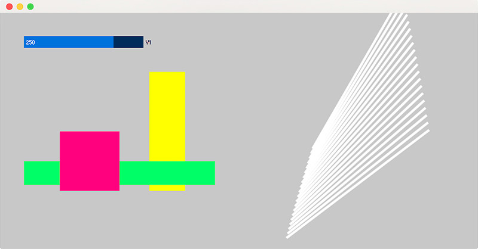
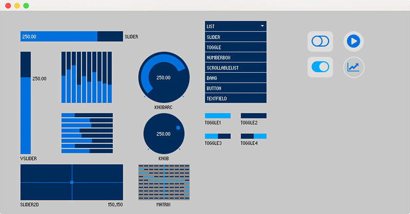

# ControlP5

ControlP5 is a GUI library written by [Andreas Schlegel](http://www.sojamo.de) for the programming environment [Processing](http://www.processing.org). 

The range of available controllers includes Slider, Button, Toggle, Knob, Textfield, RadioButton, Checkbox, Lists amongst others. These controllers can be easily added to a processing sketch, or displayed inside a separate control window. They can be organized in tabs or groups as well as rendered into PGraphics buffers. The state of a controller can be saved to file in JSON format.

## Contents 

  * [Installation](#install)
  * [How does ControlP5 work](#how)
	* [Instantiate](#controllers)
    * [Controllers](#controllers)
    * [Event Handling](#events)
    * [Customizing Controllers](#customize)
  * [Deprecated](#deprecated)    
  * [History](#history)
  * [Android](#android)
  * [Javascript](#javascript)
  * [Problems and Issues](#issues)
  * [Help](#help)
  * [Digital Object Identifiers ](#doi)

  
## <a name"install"></a>Installation

To install the library from inside the Processing IDE, use the Library Manager from the menu under Sketch &rarr; Import Library &rarr; Add Library and search for ControlP5.

If you want to install ControlP5 manually, download (the latest) version from the [releases](https://github.com/sojamo/controlp5/releases) directory. Inside the downloaded .zip file you will find [install_instructions](resources/install_instructions.txt) that guide you through the installation details and tell you where the controlP5 folder needs to be put. In case you are looking for an earlier release, please check the [archive on google code](https://code.google.com/p/controlp5/downloads/list?can=1&q=&colspec=Filename+Summary+Uploaded+ReleaseDate+Size+DownloadCount).

After you have installed ControlP5, restart the Processing IDE to make the library available.

## Getting Started

To get started, here a simple example that demonstrates how to create a slider and automatically link the slider's value to variable v1.



_example 1, see code below_


```java

	import controlP5.*;

	ControlP5 cp5;
	int v1;

	void setup() {
	  size(800, 400);  
	  noStroke();
	  cp5 = new ControlP5(this);
	  cp5.addSlider("v1")
	     .setPosition(40, 40)
	     .setSize(200, 20)
	     .setRange(100, 300)
	     .setValue(250)
	     .setColorCaptionLabel(color(20,20,20));
	}

	void draw() {
	  background(200, 200, 200);

	  pushMatrix();

	  pushMatrix();
	  fill(255, 255, 0);
	  rect(v1, 100, 60, 200);
	  fill(0, 255, 110);
	  rect(40, v1, 320, 40);
	  translate(200, 200);
	  rotate(map(v1, 100, 300, -PI, PI));
	  fill(255, 0, 128);
	  rect(0, 0, 100, 100);
	  popMatrix();

	  translate(600, 100);
	  for (int i=0; i<20; i++) {
	    pushMatrix();
	    fill(255);
	    translate(0, i*10);
	    rotate(map(v1+i, 0, 300, -PI, PI));
	    rect(-150, 0, 300, 4);
	    popMatrix();
	  }

	  popMatrix();
	}
```


_example 2, a range of default ControlP5 controllers_


## <a name"how"></a>How does ControlP5 work?


ControlP5 provides a range of controllers, each controller comes with an example which is located inside the examples/controllers folder. This is a good place to get started with ControlP5.

### Instantiate ControlP5

To create an instance of ControlP5, you need to call ControlP5's constructor and pass a reference of your sketch as argument, in most cases this will happen inside setup() and the argument for the constructor call is _this_ - the reference to the current sketch object.

```java

	import controlP5.*;
	ControlP5 cp5;

	void setup() {
		cp5 = new ControlP5(this);
	}
```

Alternatively, ControlP5 can be instantiated from other places as well for example from another object. Here, just as before, you need to pass a sketch reference as argument when instantiating the ControlP5 object.

```java

	import controlP5.*;
	GUI gui;

	void setup() {
		gui = new GUI(this);
	}

	class GUI {
		ControlP5 cp5;
		GUI(PApplet thePApplet) {
			cp5 = new ControlP5(thePApplet);
		}
	}
```

### <a name="#controllers"></a>Adding Controllers

To add controllers to a ControlP5 object, use the add function followed by the name of the Controller, for example to add a Slider use cp5.addSlider("mySlider"). Here function addSlider takes one argument which is the unique name of the controller to be added. In case a controller with the same name is already registered with ControlP5, the old controller will be overridden - this is then indicated and printed as a warning message in the console. All default add functions are implemented with class ControlP5Base; have a look at its source code for further reference.

```java

	import controlP5.*;
	ControlP5 cp5;

	void setup() {
		size(400,400);
		cp5 = new ControlP5(this);
		cp5.addSlider("mySlider");
		cp5.addButton("myButton");
	}

	void draw() {}
```

The example above adds 2 controllers to your sketch and renders them on top of your sketch. To adjust the size, position, color, etc. ControlP5 uses [method chaining](http://en.wikipedia.org/wiki/Method_chaining) and [setter](http://en.wikipedia.org/wiki/Mutator_method) functions. For example setPosition(x,y) will change the position of a controller, setSize(width,height) will change the size of a controller; the naming convention is straight forward, a function does what it says,  and the same goes for the other setters and getters as well. For further reference and overview, start with browsing the source code of class Controller and its implementations, furthermore have a look at the documentation.

```java

	import controlP5.*;
	ControlP5 cp5;

	void setup() {
		size(400,400);
		cp5 = new ControlP5(this);
		cp5.addSlider("mySlider").setPosition(20,20).setSize(200,20);
		cp5.addButton("myButton").setPosition(20,60).setSize(100,40);
	}

	void draw() {}
```

### Accessing Controllers

To access a controller in your program you can store the controller inside a variable, the example below uses a global variable slider as a reference to a Slider with name 'mySlider'

```java

	import controlP5.*;
	ControlP5 cp5;
	Slider slider;
	
	void setup() {
		size(400,400);
		cp5 = new ControlP5(this);
		slider = cp5.addSlider("mySlider");
		slider.setPosition(20,20).setSize(200,20);
	}

	void draw() {
		println(slider.getValue());
	}
```

or you can access a controller by request using ControlP5's getter functions, this comes in handy if you are working with temporary controllers, or if you do not want to keep a long list of variables.

```java

	import controlP5.*;
	ControlP5 cp5;

	void setup() {
	  size(400, 400);
	  cp5 = new ControlP5(this);
	  cp5.addSlider("mySlider").setPosition(20, 20).setSize(200, 20);
	}

	void draw() {
	  // cp5.getController returns a Controller object
	  Controller c = cp5.getController("mySlider");
	  println(c.getValue());

	  // cp5.get here returns a Slider object
	  Slider slider = cp5.get(Slider.class, "mySlider");
	  println(slider.getMin(), slider.getMax());
	}
```

### Grouping Controllers

Controllers can be grouped in different ways, the 3 options are described in more detail below.

#### Tab
you can use Tabs to organize Controllers. By default a row of Tabs will be added to the top left corner of your sketch window. The first Tab is the default Tab, hence it's name. the label can be changed by calling the ```setLabel("new name here")``` method. To add a Controller to a particular Tab, use method ```moveTo("name of Tab")``` with the argument being the name of the Tab. If a Tab does not exist when method ```moveTo()``` is called, the Tab will be created automatically.

```java

import controlP5.*;
ControlP5 cp5;

void setup() {
  
  size(400, 400);
  cp5 = new ControlP5(this);
  cp5.addSlider("s1")
     .setPosition(20, 100)
     .setSize(200, 20);
     
  cp5.addSlider("s2")
     .setPosition(20, 130)
     .setSize(200, 20)
     .moveTo("extra")
     ;
     
}

void draw() {
  background(20);
}

```

#### Group

#### Window

### What do all these Controllers do?


  - **Accordion** use an accordion to arrange multiple groups in vertical order [ControlP5accordion](examples/controllers/ControlP5accordion/ControlP5accordion.pde)
  - **Bang** triggers an event on press without passing a value [ControlP5bang](examples/controllers/ControlP5bang/ControlP5bang.pde)
  - **Button** triggers an event and passes on a value [ControlP5button](examples/controllers/ControlP5button/ControlP5button.pde)
  - **ButtonBar** a horizontal multi-button bar [ControlP5buttonBar](examples/controllers/ControlP5ButtonBar/ControlP5ButtonBar.pde)
  - **Canvas** a abstract class to create and display an image buffer [ControlP5canvas](examples/controllers/ControlP5canvas/ControlP5canvas.pde)
  - **CheckBox** [ControlP5checkBox](examples/controllers/ControlP5checkBox/ControlP5checkBox.pde)
  - **ColorPicker** a 4 slider color picker to change the red, green, blue and alpha channel of a color [ControlP5colorPicker](examples/controllers/ControlP5colorPicker/ControlP5colorPicker.pde)
  - **ColorWheel** a color wheel picker, use the arrow on the left to change saturation [ControlP5colorWheel](examples/controllers/ControlP5colorWheel/ControlP5colorWheel.pde)
  - **DropdownList** (use ScrollableList instead)
  - **Group** for grouping and nesting controllers [ControlP5group](examples/controllers/ControlP5group/ControlP5group.pde)
  - **Icon** adds Icon support, an Icon behaves like a Button or Toggle [ControlP5icon](examples/controllers/ControlP5icon/ControlP5icon.pde)
  - **ListBox** (use ScrollableList instead)  
  - **Knob** a rotary slider, mousewheel support [ControlP5knob](examples/controllers/ControlP5knob/ControlP5knob.pde)
  - **Matrix** a 2D array of toggles [ControlP5matrix](examples/controllers/ControlP5matrix/ControlP5matrix.pde)
  - **Numberbox** changes values when dragging horizontally or vertically, mousewheel support [ControlP5numberbox](examples/controllers/ControlP5numberbox/ControlP5numberbox.pde)
  - **RadioButton** [ControlP5radioButton](examples/controllers/ControlP5radioButton/ControlP5radioButton.pde)
  - **Range** a slider like Controller with adjustable end points [ControlP5range](examples/controllers/ControlP5range/ControlP5range.pde)
  - **ScrollableList** a list that currently implements and replaces ListBox and DropdownList, mousewheel support [ControlP5scrollableList](examples/controllers/ControlP5scrollableList/ControlP5scrollableList.pde)
  - **Slider** a number slider, can be horizontal or vertical, mousewheel support [ControlP5slider](examples/controllers/ControlP5slider/ControlP5slider.pde)
  - **Slider2D** a 2D draggable Controller [ControlP5slider2D](examples/controllers/ControlP5slider2D/ControlP5slider2D.pde)
  - **Tab** arrange Controllers inside separate Tabs [ControlP5tab](examples/controllers/ControlP5tab/ControlP5tab.pde)
  - **Textfield** a field for single line text input [ControlP5textfield](examples/controllers/ControlP5textfield/ControlP5textfield.pde)
  - **Textarea** a multi line area for text output, mousewheel support [ControlP5textarea](examples/controllers/ControlP5textarea/ControlP5textarea.pde)
  - **Textlabel** a Controller to display a single line text element [ControlP5textlabel](examples/controllers/ControlP5textlabel/ControlP5textlabel.pde)
  - **Toggle** switches between 2 states, true and false [ControlP5chart](examples/controllers/ControlP5chart/ControlP5chart.pde)

### What else is there?

  - **Chart** displays a list of numbers as line, pie or bar chart, useful to display real-time data coming for example from an Arduino SerialEvent [ControlP5chart](examples/controllers/ControlP5chart/ControlP5chart.pde)
  - **FrameRate** a Textlabel that displays the current FrameRate [ControlP5frameRate](examples/extra/ControlP5frameRate/ControlP5frameRate.pde)
  - **Pointer** use custom xy coordinates to replace the mouse [ControlP5pointer](examples/extra/ControlP5pointer/ControlP5pointer.pde)
  - **Println** hijacks the default Processing console output and displays the output inside your sketch window. [ControlP5console](examples/extra/ControlP5console/ControlP5console.pde)
  - **Properties** captures the state of Controllers which can then be saved or loaded from disk or memory [ControlP5propertiesSets](examples/extra/ControlP5propertiesSets/ControlP5propertiesSets.pde)


### Bring a Controller to the front

To change the order of controllers, use Controller.bringToFront() which will position a controller on top of all others. See example [ControlP5bringToFront](examples/use/ControlP5bringToFront/ControlP5bringToFront.pde)


### Rendering

#### Default rendering

#### Customised rendering

### Saving and loading states

### Removing Controllers

### Separate Windows

To render controllers into separate windows please see example [ControlP5frames](examples/use/ControlP5frames/ControlP5frames.pde), this example demonstrates how to open multiple frames each running its own instance of ControlP5. With previous version of ControlP5 the ControlWindow class would allow you to add and open new windows with 1 command, this comand though has been removed when all references to java.awt.* had been removed to make ControlP5 work with Android.

## <a name="events"></a>Event Handling

#### Linking a Variable or Function to a Controller

#### ControlEvent

#### Callbacks

#### Customized Event Handling

## <a name="customize"></a>Customizing Controllers


## <a name="deprecated"></a>Deprecated

#### My code worked before now it doesn't anymore

Methods such as value(), name(), controller() and all other methods that are used to get or set object variables have been prefixed with get and set - value() became getValue() and setValue(). In previous (before 2.2.1) version these deprecated methods were still available but have been removed with >= version 2.2.1


#### Tooltip, MultiList, DropdownList, ListBox

Due to various changes and modifications the tooltip has been removed for now since it became incompatible, the same goes for MultiList - will they come back? I doubt it. ListBox and DropdownList are still available but have been replace with the ScrollableList, please have a look at the ScrollableList source and example


## <a name="history"></a>History

ControlP5 is a project that started in 2006 as a very simple GUI for controlling Processing parameters for better debugging, testing and interaction purposes. Starting from only 3 controllers the controller base has grown into around 30 controllers and over 70 examples. A history of controlP5 versions is available on [google code downloads](https://code.google.com/p/controlp5/downloads/list?can=1&q=&colspec=Filename+Summary+Uploaded+ReleaseDate+Size+DownloadCount). This library has been widely used by processing user in academic, research and professional environments for prototyping and tool development.


### Why is controlP5's source code so convoluted and bloated

ControlP5 has been in development for over 9 years and started as a small GUI library for Processing. Over the years both Processing and ControlP5 have grown substantially and as part of that journey many changes have been applied to both. From a ControlP5 perspective some changes were due to changes made to Processing's API and source code, other changes were due to additional controller implementations, extended functionality, user feedback and reuqests. Since writing controlP5 from scratch was a whole learning process in itself, a proper initial strategy for the software architecture of the library was missing. When it became apparent that a proper architecture would have made the development much easier and comfortable it was already too late, I had to comply to the piles of code I had created. Would I do things differently now? yes I would.


## Font rendering

Why is the bit-font so blurry? it used to be crisp. Let me blame this on the OpenGL texture rendering. If you have a suggestion or a simple and easy to implement solution, please use the issues section to let me know.


## <a name="android"></a>Android

Most controllers work in Android mode, the Textfield controller though does not due to keyboard/character-mapping irregularities between Android and Desktop mode. This has not been fixed yet. Touch events are handled by Processing's event handling, there is a short delay before detecting a touch (down) event, hence events will only fire after this short delay, move and drag events respond quicker. For Android license compatibility see [LICENSE.md](LICENSE.md), last paragraph.

## <a name="javascript"></a>Javascript

Currently there is no javascript version of ControlP5, though I had started implementing a slimmed down version for processing.js but since it is currently unclear which javascript version - processing.js or p5.js - will become the default js version of processing, controlP5.js is on hold. There is a tendency that p5.js will become the primary javascript environment

## <a name="issues"></a>Problems and Issues

In case you run into problems and issues, please use ControlP5's issues section that comes with this repository. Many questions might already have been answered in the [Processing forum](http://forum.processing.org/two/discussions) and you might find quick help and pointers by [searching for controlP5](http://forum.processing.org/two/search?Search=controlp5) or going through the [list of posts tagged with controlP5](http://forum.processing.org/two/discussions/tagged/controlp5). 


## <a name="help"></a>Help

If you want to help improve ControlP5, the first place for me to do so would be the source code documentation where supporting comments are desperately needed to create a concise and comprehensive javadoc.  

If you have used ControlP5 in any of your projects, let me know, send me details, send me links, send me screeshots.

## <a name="doi"></a>Digital Object Identifiers

Digital Object Identifiers (DOI) are the backbone of the academic reference and metrics system which allows researchers writing software to make their work they share on GitHub citable by archiving one of their GitHub repositories and assigning a DOI with the data archiving tool Zenodo [(link)](https://guides.github.com/activities/citable-code/).

[](http://dx.doi.org/10.5281/zenodo.16290)

Copyright 2006-2015 Andreas Schlegel
